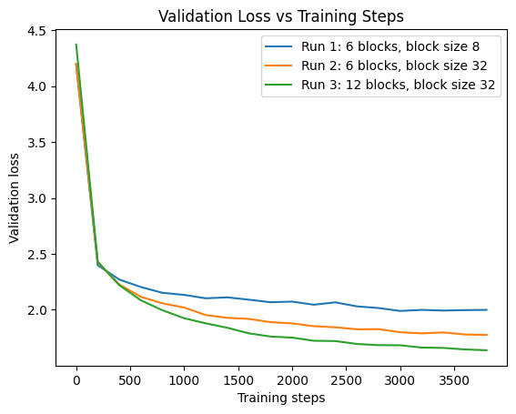

In this episode, we will go into some details of the causal transfomer implementation. Some toy experiment results are shown to analyze transformer, in an attempt to understand what drives the performance. We will not go through every single line of implementation. The code used for illustration can be found: https://github.com/yuansen23aa/GPT-learning/blob/main/basic_gpt.ipynb, which largely follows Anrej Karpathy's nanoGPT implementation with some modifications. So Let's dig in.

We use those terms interchangeably: block size = sequence length, causal attention = masked attention, causal transformation = decoder-only transformer. 

# Overall structure

Let's peel the onion and see layer by layer of the overall structure.  

- GPT  = Embbeding Lookup -> **Attention Blocks** -> LM

- Attention Blocks = [**Multihead Self Attention** -> Feed Forward Network]

- Multihead Self Attention = Concat All Single **Masked Self Attention** Head

Following this structure, we need to implement the following classes: GPT, Attention Blocks, Multihead Attention, Masked Self Attention, Feed Forward Network.

- **GPT class**:
    - **Forward**: map  X id matrix (batch size, block size) into token embedding tensor (batch size, block size, emb size), create position embedding (block size, emb size) and broadcast it to (batch size, block size, emb size) and add position and token embedding together as the input for attention blocks. The attention blocks spit out (batch size, block size, emb size) tensor as LM head input, LM will map emb size to vocab size as logits vector for all batch size * block size tokens. 
  - **Generation**: autoregressive token generation based on input context. 

- **Attention blocks**: since we first layernorm input x for multihead attention, then run residual connection x + mha(x). Similarly, we do layernorm for FFN and residual connection sequetially. 

- **Multihead attention**: the main role is concatenation

- **Masked self attention**: implement Q, K, V and masked attention head. 

- **Feed Forward Network**: projecting multihead attention output to 4*emb size hidden layer with GeLu, then projecting to the output with size emb size. 


# Bug prone components

Instead of checking the entire implementation, we highlight the parts that are essential but error prone. 


## Shift Input Position by 1
````python

class dataloaderlite:
    def __init__(self, data, block_size, batch_size, device, shuffle=True, tag=None):
      ...

    ...
    def __next__(self):
       ...   
        x = torch.stack([self.data[i:i+self.L] for i in idx])
        y = torch.stack([self.data[i+1:i+self.L+1] for i in idx])    
        return x.to(self.device), y.to(self.device)

````
The last three lines of the dataloader we implemented are crucial because it defines y as 1 poisition ahead of x so that the model is properly defined. Additionally, it registers the input and target to the device (cpu or cuda) used.


## Pay attention to the pytorch status/mode

````python
@torch.no_grad()
def loss_estimation(model, grad_norm=False):
    output = {}
    model.eval()
    ....
    model.train()
    return output

````

Whe decorator @torch.no_grad() disables gradient calculation via Not creating computation graph to speed up the inference. When eval started, we enter eval mode so that functionalities such as dropout can be called correctly. Finally, remember to switch back to train mode when eval is done.

## Input reshaping for cross entropy loss

````python
class GPT(nn.Module):
    ...
    def forward(self, x_id_matrix, y_id_matrix=None):
        ...
        else:
            targets = y_id_matrix.view(Batch_size * Block_size)
            logits = logits.view(Batch_size * Block_size, Vocab_size)
````

The reshaping flatterns both targets and logits so inputs can be accepted by the cross entropy loss. Bascially, you can think of Batches of Blocks as a single long block by stitching batches one after another. Given the memory is laid out by row-first internally, the view() will treat the last dimension of logits unchanged (vocab size) and will collaps the first two dimensions.  


## Masked Attention

````python
class MaskedAttention(nn.Module):
    def __init__(self, num_heads, embed_size):
        super().__init__()
        self.head_size = embed_size // num_heads
        self.q_proj = nn.Linear(embed_size, self.head_size, bias=False)
        self.k_proj = nn.Linear(embed_size, self.head_size, bias=False)
        self.v_proj = nn.Linear(embed_size, self.head_size, bias=False)

    def forward(self, x):
        B, L, _ = x.shape
        q, k ,v = self.q_proj(x), self.k_proj(x), self.v_proj(x)
        kt = k.transpose(-1,-2)
        att = q @ kt/ (self.head_size**0.5)
        mask = torch.tril(torch.ones(B, L, L, device=device, requires_grad=False))
        att = att.masked_fill(mask == 0, float('-inf'))
        weights = F.softmax(att, dim=-1)
        weights = self.dropout(weights)
        att_output = weights @ v
        return att_output 
````

It is important to note that we 
implement maksing through masking elements above the diagonal in the attention weight matrix. Feel free to compare this implementation to the transformer part I to map the math to the implementation here. Last but not least, remember to register the device to the mask trigular matrix! 

Question: why we get B, L from input x instead of using global batch size and block size ?
Will reveal the answer in a moment.

## Autoregressive Generation 
````python
   def generate(self, x_id_matrix, max_new_tokens, top_k):
        B, L = x_id_matrix.shape
        out = x_id_matrix.clone()
        for _ in range(max_new_tokens):
            if x_id_matrix.shape[1] > self.block_size:
                x_id_matrix = x_id_matrix[:, -self.block_size:]   
            logits, _ = self(x_id_matrix)
            # focus only on the last time step
            logits = logits[:, -1, :] # (B, vocab_size)
            top_k_logits, top_k_indices = torch.topk(logits, k=top_k)
            top_k_probs = F.softmax(top_k_logits, dim=-1) # (B, vocab_size)
            # sample from the distribution
            sampled = torch.multinomial(top_k_probs, num_samples=1) # (B, 1)
            next_id = torch.gather(top_k_indices, -1, sampled)  # (B, 1)
            # append sampled index to the running sequence
            x_id_matrix= torch.cat((x_id_matrix, next_id), dim=1) # (B, L+1)
            out = torch.cat((out, next_id), dim=1)
        return out

````

The token generation is worth a closer look because the autoregressive generation is quite deferent from inference during training. Here x_id_matrix is our prompt, we can start with any arbitrary prompt with length no greater than global block size. Say if we start with torch.zeros((1,1)), it basically says batch size = 1 and the first token index is 0. The autoregressive token generation will sample the next token according to the predicted probabilties and add it to the current x_id_matrix and repeat the process. 

- **truncation**: since the x_id_matrix will keep growing and once it hits the context window length limit: block_size, we have to truncate it and only keep the last block_size token for token generation: $P(t_{k} | t_{k-1}, ..., t_{t - L})$ where $L$ is block size.

- **attention inference**: it's time to reveal the answer to the question why using local B, L = x.shape. The reason is because during text generation, B and L are decided by conext or x_id_matrix. In the very beginning, L is just 1 and the number will dynamically change as we keep adding generated token index to x_id_matrix.

- **top k rule**: top k rule is defined to eliminate noisy candidates with small probablities so we will only sample token from the top k tokens ranked by logits.


# Experiments

We will identify drivers of the good performance of causal transformer. We use the same dataset (tiny shakespare) used by https://www.youtube.com/watch?v=kCc8FmEb1nY, it has 40,000 lines of Shakespare from a varienty of Shakespare's plays. The dataset is tiny so our goal is to see how much validation loss we can achieve and how close the generated text is to English sentences.   

As a baseline comparison, we implemented a basic FFN and the best validation loss is around 2.500, even after we increase the model size, the loss stays roughly the same.  The generated text looks better than random, but apparently departs nontrivially from English.

````python
I'd payou ead me
BAThoweve,
Tof s, qurarore gerilyrsondghys R blere ar urss bld u d wachaigureap anuneilf an ppirear a g th nof nd wicowhy:
Byowindiveatirw'su quenglle V: wha pe ghat wsod fut'd f aphay:
Lowilichesor us s CO t:--lerand oof giearelos s'd alal me was
Thome n forind Talingnen at n ubu sse pr s whee tate's st fumy t s, se wahfongisow,
ARD:
Coomo, geind,
Fire
ARCImowir

ARAng;
Yond aleed y,
ARDo wnd by beake,
THangaithilond y, thenct t he, wize isard oures:
````

We will first start with basic transformer with following setup 
````python
batch_size = 32 # how many independent sequences will we process in parallel?
block_size = 8 # what is the maximum context length for predictions?
max_iters = 4000 # the number of training iterations
learning_rate = 1e-3 # learning rate
embed_size = 64 # embedding size
num_heads = 4
num_blocks = 2
````

The loss will go sharply down to 2.038 vs. 2.500 (baseline) and generated text below looks closer to English and the structure looks closer to Shakespears' plays. **Residual Connection** is essential, without which the performance will crash, the loss will grow to 3.34 and generate nonsense. In this regard, Attention is not all we need, we also need residual connection. 

````python
ANTH:
SwO, but madions, treing,' and
And hand youful death:
That sing and's hor butse hath he me; as the hearth
A const acto-se of the murdindifords the mads ack ying a sair oness,
As still hearld with in in,
Had comition
Thork what morrus to
that wearnief station ands to at house.

LARDII:
Had it.

LUCIO:
Sayonsher,
Bution thy the what sits there in say

````

# Scaling Law & Weight Init
Although we train on a tiny dataset, increasing model capacity seems to work better on reducing validation loss. First we increase the block size by 4x to increase the model size through position emb scaling, the loss reduction is clear. Second, we 2x the depth by double the number of blocks, the validation loss can be reduced to 1.631 vs. 2.038 (no scaling). We also started to see many English words to appear!

It is worth pointing out that apply weight init with std = 0.02 further improves the performace with loss = 1.610.



````python
He be sun whister it be sway
To his atch'd your limiss bound
Of him over sompetie, and flight, from the publiness
Bestista'd and to friend of this senden for you.

KING RICHARD II:
But it bate, and warred to my chare-lip thy life.

CAPULET:
Now, such I cress the cause of the pause of warrior
And can speak toge in hear as towe they broak!

AGOM:
I my
doubt in thy lady poor, and, If their safeth; whose while have abjoy.
But wwhat acquital me that I have heard the poor.
Why citizen him sin, and thr
````

# Summary
We covered the implementation and experiment results to demonstrate the sueprior performance of decoder only transformer. In the next episode, we will visit the topic of efficiency including KV cache, FlashAttention, PageAttention and so on. 